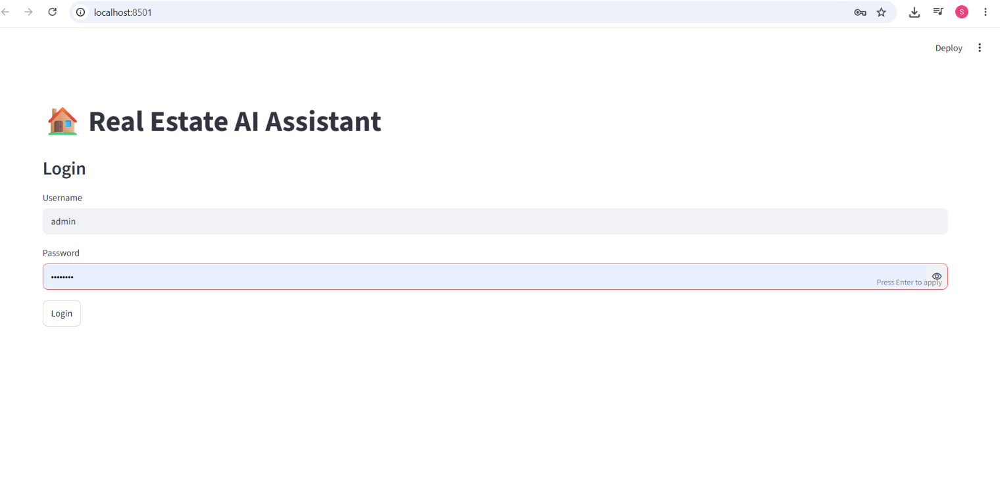
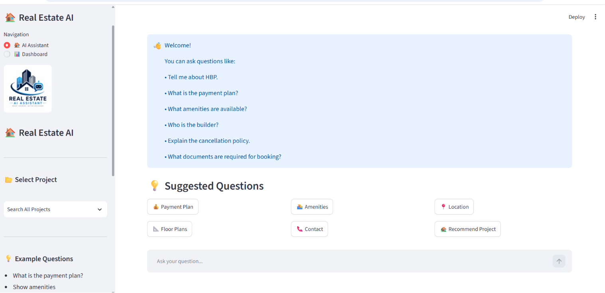
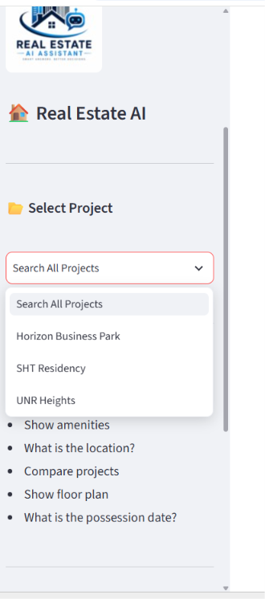
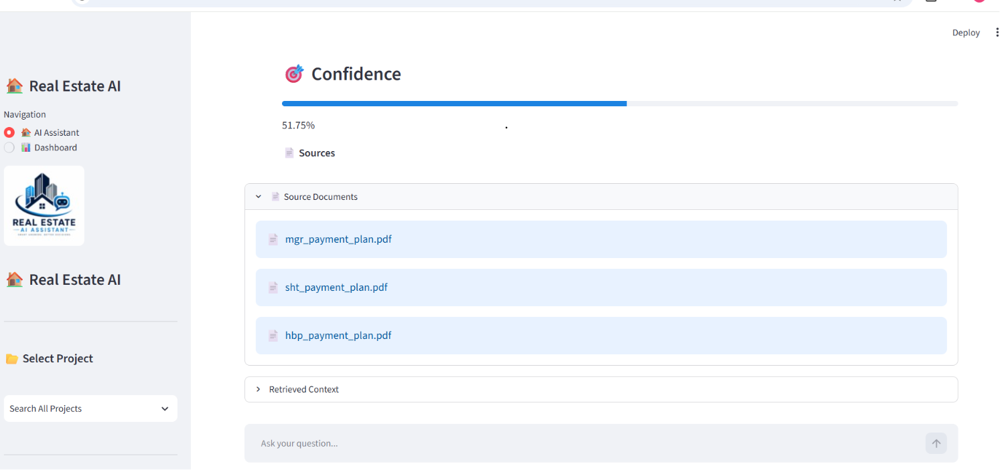
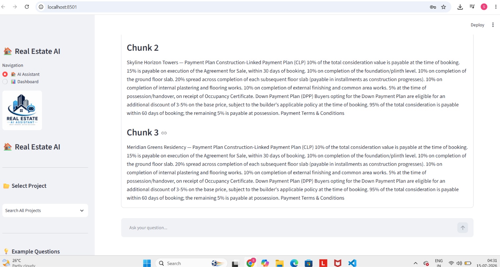
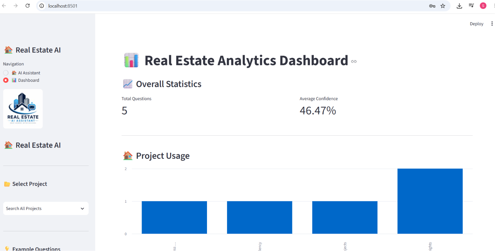
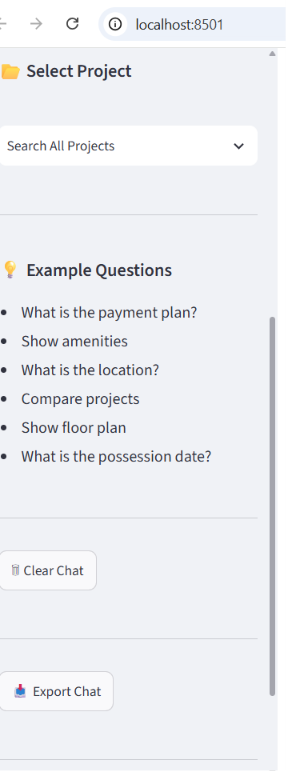

# 🏠 AI Real Estate Assistant (RAG)

An intelligent AI-powered Real Estate Assistant built using **Retrieval-Augmented Generation (RAG)**. This application enables customers to instantly retrieve accurate information about real estate projects by asking questions in natural language.

Instead of manually searching through lengthy project brochures and documents, users can simply ask questions such as payment plans, amenities, floor plans, pricing, location, possession dates, builders, and more. The assistant retrieves relevant information from the knowledge base and generates reliable answers using Google's Gemini AI.

---

# 🎯 Project Objective

The objective of this project is to build an AI-powered customer support assistant for real estate companies. The assistant helps customers quickly find project-related information from official documents, reducing manual customer support effort while providing fast and accurate responses.

---

# 🚀 Features

- 🤖 AI-powered chatbot using Google Gemini
- 📄 Retrieval-Augmented Generation (RAG)
- 🔍 Semantic document search using FAISS
- 🧠 Context-aware conversation memory
- 🏘️ Multi-project support
- 📂 Project-wise filtering
- 📊 Confidence score for every response
- 📑 Source document citation
- 💬 Suggested question buttons
- 📥 Export chat as PDF
- 📈 Analytics dashboard
- 🔐 Login Authentication
- 🌐 Streamlit Web Application

---

# 🏗️ Real Estate Projects Included

- Horizon Business Park (HBP)
- SHT Residency
- UNR Heights

Users can search across all projects or select a specific project before asking questions.

---

# 💡 Example Questions

- What is the payment plan?
- Show available amenities.
- Compare HBP and SHT Residency.
- What is the possession date?
- Who is the builder?
- Show available floor plans.
- Explain the cancellation policy.
- What documents are required for booking?
- Recommend the best project.

---

# 🛠️ Tech Stack

## Frontend

- Streamlit

## Backend

- Python

## Artificial Intelligence

- Google Gemini 3.1 Flash Lite
- LangChain
- FAISS Vector Database
- HuggingFace Embeddings

## Libraries

- Streamlit
- LangChain
- LangChain Community
- LangChain Google GenAI
- HuggingFace Sentence Transformers
- FAISS
- ReportLab
- Python Dotenv

---

# 📂 Project Structure

```text
AI-Real-Estate-Assistant-RAG/
│
├── app.py
├── rag_engine.py
├── vector_store.py
├── login.py
├── analytics.py
├── utils.py
├── requirements.txt
├── README.md
├── .gitignore
├── .env
│
├── assets/
│   └── logo.png
│
├── data/
│   ├── hbp_payment_plan.pdf
│   ├── sht_payment_plan.pdf
│   └── unr_payment_plan.pdf
│
└── vector_db/
    ├── index.faiss
    └── index.pkl
```

---

# ⚙️ Installation

## Clone Repository

```bash
git clone https://github.com/sivasubramayam/AI-Real-Estate-Assistant-RAG.git
```

## Navigate to Project

```bash
cd AI-Real-Estate-Assistant-RAG
```

## Create Virtual Environment

```bash
python -m venv venv
```

## Activate Environment

### Windows

```bash
venv\Scripts\activate
```

### Linux / Mac

```bash
source venv/bin/activate
```

## Install Dependencies

```bash
pip install -r requirements.txt
```

## Create .env File

```env
GOOGLE_API_KEY=YOUR_GEMINI_API_KEY
```

## Run the Application

```bash
streamlit run app.py
```

---

# 🧠 How It Works

1. User asks a question.
2. The question is converted into embeddings.
3. FAISS searches the most relevant document chunks.
4. Retrieved context is sent to Google Gemini.
5. Gemini generates an accurate answer.
6. The assistant displays:
   - Answer
   - Confidence Score
   - Source Documents
   - Retrieved Context

---

# 📊 Features Implemented

✅ Login Authentication

✅ Conversation Memory

✅ Multi Project Filtering

✅ Semantic Search

✅ Retrieval-Augmented Generation (RAG)

✅ Source Document Citation

✅ Confidence Score

✅ Analytics Logging

✅ Suggested Questions

✅ Export Chat to PDF

✅ Responsive Streamlit Interface

---

# 📸 Screenshots

# 📸 Screenshots

## 🔐 Login Page



---

## 🏠 Home Page



---

## 📂 Project Selection



---

## 🎯 Confidence Score



---

## 📄 Retrieved Context (Document Chunks)



---

## 📊 Analytics Dashboard



---

## 📥 Export & Clear Chat



---

# 🔮 Future Improvements

- Voice-based Assistant
- Image Search
- Multi-language Support
- Live Property Database
- Admin Dashboard
- CRM Integration
- WhatsApp Integration
- Email Notifications
- Property Recommendation Engine
- User Feedback System

---

# 📈 Business Benefits

- Reduces customer support workload
- Provides instant responses to customer queries
- Improves customer experience
- Centralized knowledge retrieval
- Easy to maintain and update
- Saves time for sales teams
- Supports multiple real estate projects

---

# 👨‍💻 Author

**Chintala Siva Subramanyam**

B.Tech (Artificial Intelligence & Machine Learning)

GitHub:
https://github.com/sivasubramayam/AI-Real-Estate-Assistant-RAG/

LinkedIn:
https://linkedin.com/in/subramanyam-212145373

---

# ⭐ Support

If you found this project useful, please consider giving this repository a ⭐ Star on GitHub.

---

# 📄 License

This project is developed for educational purposes and technical assessment.